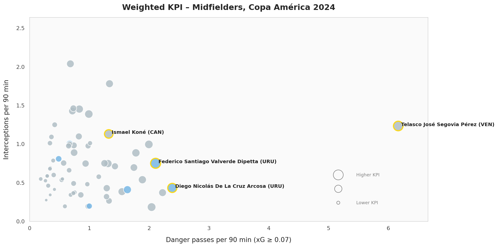
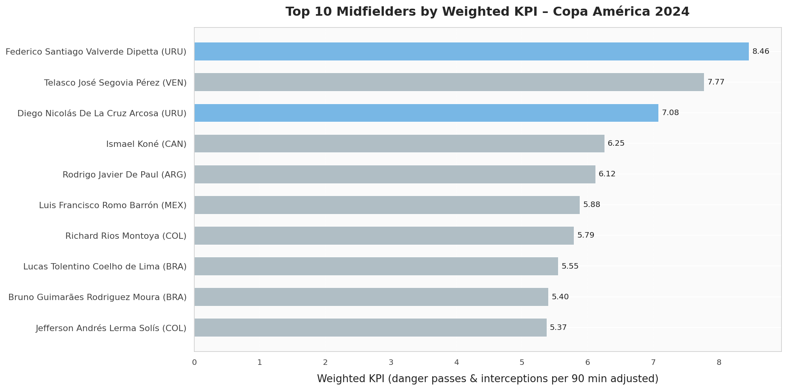

# Valverde – Influence in Adverse Game Situations (Copa América 2024)

This project analyzes Federico Valverde’s performance at the 2024 Copa América, focusing on his contributions **when Uruguay was drawing or losing**. While Valverde didn’t stand out in traditional stats like goals or assists, this analysis investigates whether his influence could be captured through actions that change the course of a match under pressure.

## 🔍 Project Objective

To evaluate **which midfielders had the greatest impact in adverse match situations**, using a custom KPI built from:

- **Danger Passes**: completed passes that lead to a shot with xG ≥ 0.07 within the next 15 seconds  
- **Interceptions**: ball recoveries when the team is not ahead

The final metric is **normalized per 90 minutes** and **adjusted using a square root of minutes played**, allowing fair comparisons across all midfielders in the tournament.

## 📊 Visualizations

- **Scatter Plot**: Compares all qualifying midfielders by danger passes and interceptions per 90 minutes. Circle size reflects the weighted KPI.
- **Bar Chart**: Shows the top 10 midfielders ranked by the final adjusted KPI.

<div align="center">
  <br>
  <em>Scatter plot comparing midfielders in adverse match states</em>
</div>

<div align="center">
  <br>
  <em>Top 10 midfielders by weighted KPI</em>
</div>

## 📄 Project Summary

> Valverde didn’t dominate through goals or assists, but the data shows his presence was consistent and valuable in moments where Uruguay needed to recover or progress.  
> Among all Copa América midfielders, he stood out in key defensive recoveries and actions that preceded dangerous shots — confirming a type of influence that often goes unnoticed.

## 🛠️ Requirements

To run the analysis and reproduce the visualizations, install the following packages:

```bash
pip install pandas matplotlib numpy
